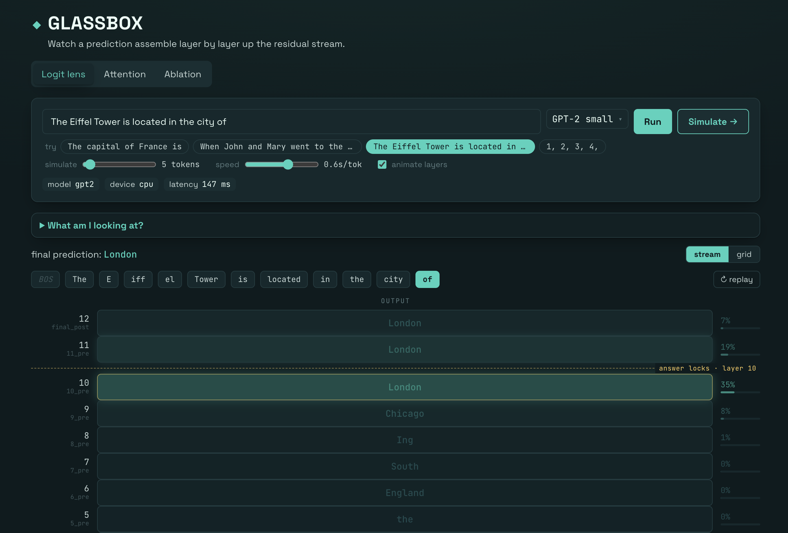
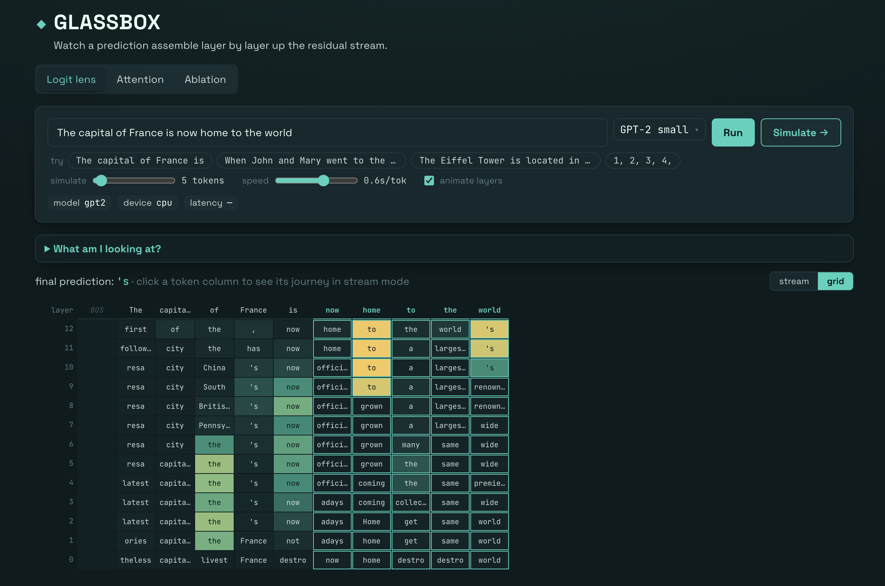
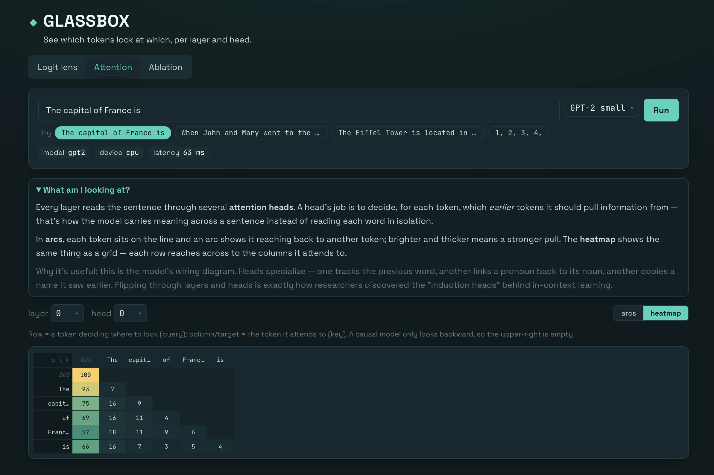
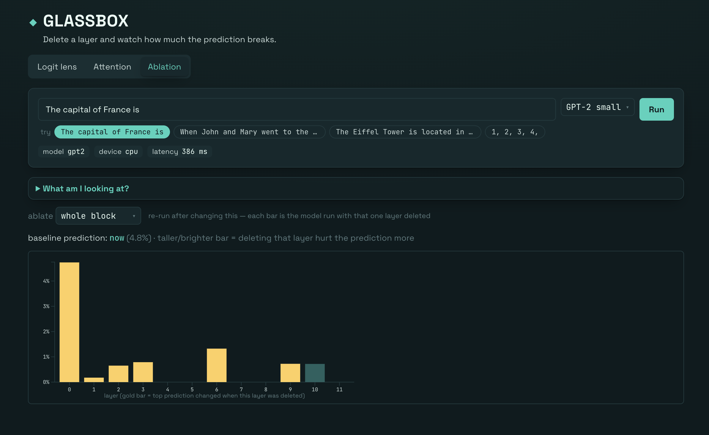

# glassbox

See what a language model is thinking, layer by layer. **Logit lens · attention patterns ·
layer ablation** — built on TransformerLens + FastAPI + React.

<p align="center">
  
</p>

## Why this exists

A transformer doesn't predict the next word in one shot. It builds the answer gradually: a
stack of hidden vectors — the *residual stream* — passes upward through dozens of layers,
each one nudging the guess a little closer. Normally none of that is visible; you see the
prompt go in and a token come out.

GLASSBOX makes the middle visible. The core trick is the **logit lens**: take the residual
stream *as it is at every layer* and decode it through the model's own output head, as if the
model had to commit to an answer right there. Do that at all layers and you can literally watch
a prediction get assembled — vague early, sharpening as it climbs, snapping to the final token
near the top.

It ships three lenses on the same forward pass:

- **Logit lens** — decode the residual stream at *every* layer and watch the next-token
  prediction take shape as data flows upward.
- **Attention** — per-layer, per-head `[query, key]` patterns: which tokens look at which.
- **Ablation** — zero a layer's writes to the residual stream and measure what breaks, layer by
  layer, to find the load-bearing ones.

Default model is GPT-2-small, but any registered checkpoint works.

## Features

### Logit lens



A layer × token grid of what the model would predict if it stopped at each layer. Read bottom
to top and watch the prediction firm up — early layers hedge, upper layers converge. Hit
**Simulate** and it runs autoregressively, feeding each generated token back in so you see the
lens evolve token by token.

### Attention



See which tokens look at which, per layer and head. Each head is a `[query, key]` heatmap, so
the recognizable patterns — diagonals, previous-token heads, induction — jump out visually.

### Ablation



Delete a layer's contribution to the residual stream and measure how much the prediction breaks.
Sweeping layer by layer surfaces the load-bearing ones: the spikes are where the model actually
does the work.

## Quickstart

Requires [uv](https://docs.astral.sh/uv/) and Node 22+. From the repo root:

```bash
make setup    # uv sync (backend) + npm ci (frontend)
make dev      # run backend (:8000) and frontend (:5173) together
```

Or individually: `make api`, `make web`. First backend run downloads GPT-2-small (~500 MB) and
warms it at startup. CPU by default — the MPS backend on Apple Silicon can return
silently-incorrect numbers, and GPT-2-small is small enough that CPU is plenty fast.

There's also a standalone CLI demo that renders a heatmap to `backend/outputs/`:

```bash
cd backend && uv run python scripts/run_logit_lens.py
```

## Layout

```
backend/    FastAPI service + the interpretability core (Python, uv).
            app/{main,api,core,services,schemas} — see backend internals below.
frontend/   React + Vite + D3 UI (TypeScript).
plans/      Design notes and the weekend roadmap.
```

**Backend internals** (`backend/app/`):

- `main.py` — the FastAPI app: lifespan, CORS, router wiring. Nothing else.
- `api/` — `routers/` (one `APIRouter` per endpoint) and `deps.py` (shared `resolve_model`).
- `core/` — `config.py` (settings), `manager.py` (resident-model LRU cache), `models.py`
  (registry + loader).
- `services/` — the numerics: `logit_lens.py`, `attention.py`, `ablation.py`, `tokens.py`. Each
  is the single boundary where tensors become JSON-serializable result objects.
- `schemas/` — `requests.py` (request bodies) and `results.py` (response shapes the frontend mirrors).

## Make targets

| Target            | What it does                                         |
| ----------------- | ---------------------------------------------------- |
| `make setup`      | Install backend + frontend deps                      |
| `make dev`        | Run backend and frontend together                    |
| `make api` / `web`| Run one side                                         |
| `make test`       | Full backend suite (boots a real model)              |
| `make test-fast`  | Model-free tests only (`-m "not slow"`)              |
| `make lint`       | ruff (backend) + eslint (frontend)                   |
| `make format`     | Auto-format the backend with ruff                    |

## Configuration

Backend settings are read from `GLASSBOX_`-prefixed env vars (or a `backend/.env`):

| Variable                | Default                  | Purpose                                  |
| ----------------------- | ------------------------ | ---------------------------------------- |
| `GLASSBOX_CORS_ORIGINS` | `http://localhost:5173`  | Comma-separated browser origins for CORS |
| `GLASSBOX_DEFAULT_MODEL`| `gpt2`                   | Model warmed at startup                  |
| `GLASSBOX_DEVICE`       | auto (CPU/CUDA)          | Force `cpu` / `cuda` / `mps`             |
| `HF_TOKEN`              | —                        | Required to load gated models (e.g. Gemma) |

The frontend points at the backend via `VITE_API_URL` (default `http://localhost:8000`).
